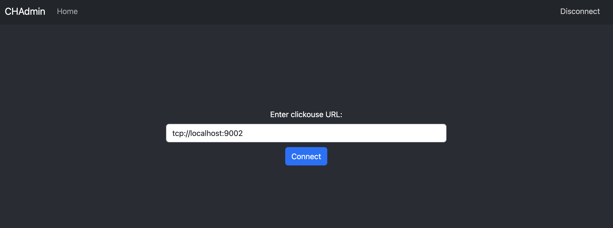
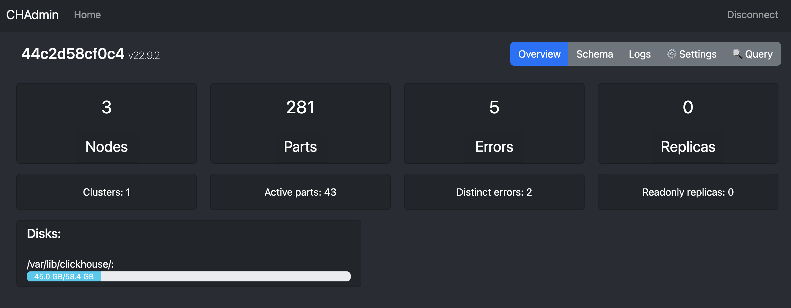
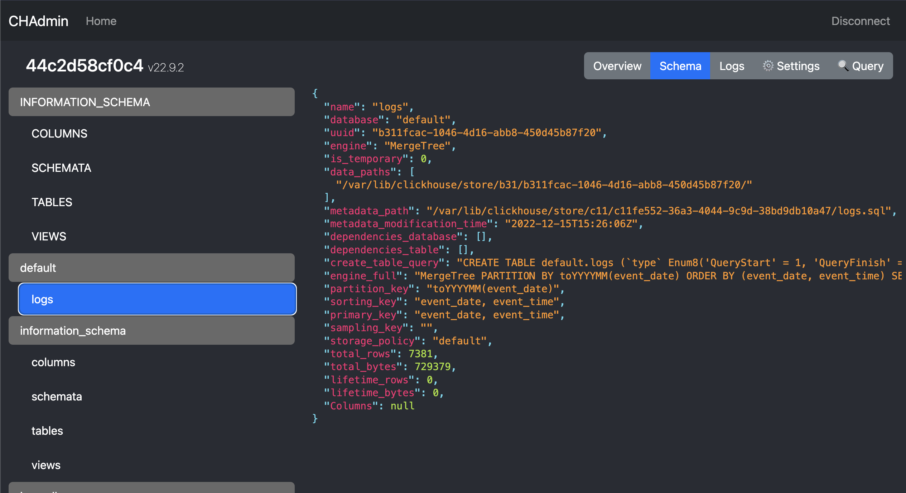
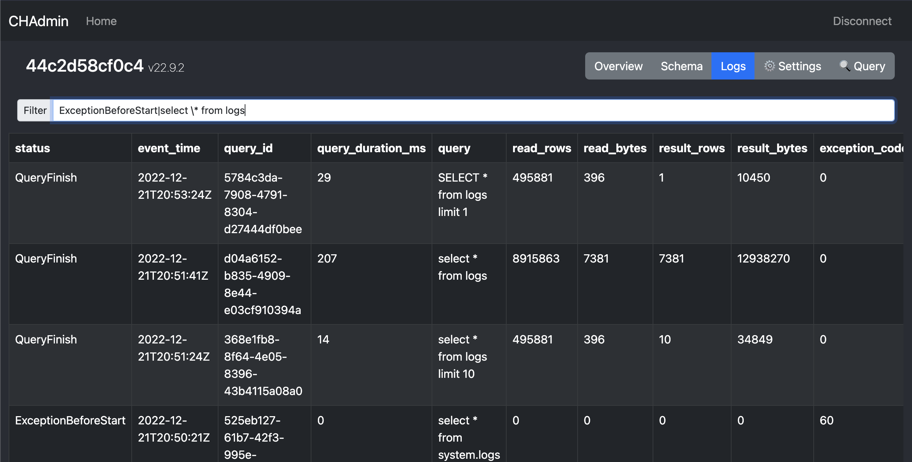
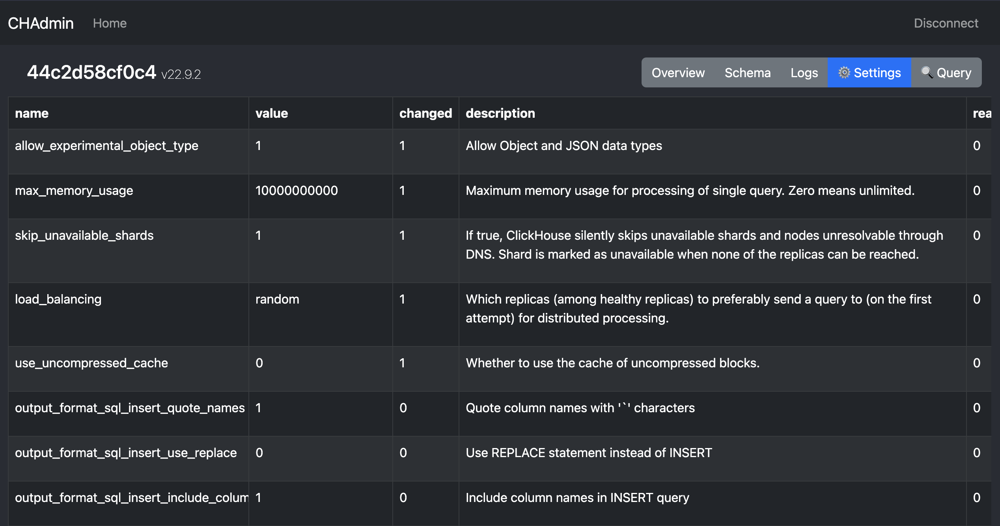
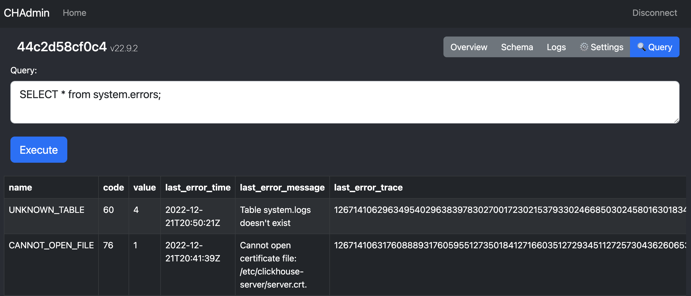

# CHADMIN
#### Video Demo:  <URL HERE>
#### Description:
UI that allows you to check the state and status of your clickhouse cluster.

App constists of two parts:
- Backend is a golang application.
- Fronend is a typescript + react.

You need to have an access to clickhouse tcp endpoint from the backend. Connection string must valid DSN uri.

You can check the default metrics, like errors, amount of nodes in cluster or readonly replicas. 

You can find useful to check the table schemas (create queries) and other information, like amount of parts, rows, size in byte. 

You can see the query logs, check them for errors or just find the stats of the selected query. Filter works with regexp.

Checkout the changed and default settings values

You can select any data and run any queries that you want and get pretty enough output.

---

## Features

- Disks statuses ✅
- Run any query and get simple react table output ✅
- Checking and filtering logs ✅
- Get settings ✅
- Check data schemas and configuration ✅
- Check status of running queries and mutations ✅ 🚧
- Working with part and partitions 🚧
- Monitor your cluster status overall (parts health checks, user's quota) 🚧
- Query statistics. Can be helpful in slow query investigation 🚧
- Table's replication status 🚧
- Table's sharding status 🚧
- Running and monitoring migrations/mutations 🚧
- Adding and removing nodes from cluster (? possibly need configuration access to nodes) 🚧
- Creating and evaluating alerts which exposed like prometheus metrics 🚧
- Move data between clickhouse servers 🚧